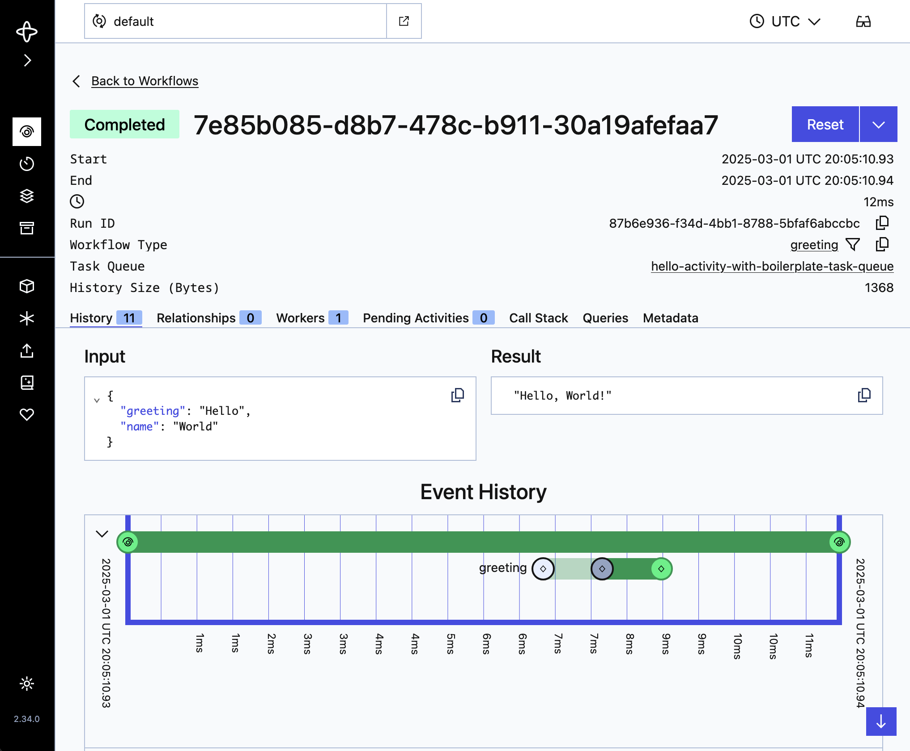

# (Unofficial) Haskell Temporal SDK Cookbook

This is a set of examples for the [(unofficial) Haskell SDK](https://github.com/MercuryTechnologies/hs-temporal-sdk/).

## Examples

Most examples assume a Nix development shell and running Temporal development
server; see [the usage section](#usage) below for details.

- [hello](./hello) - basic examples
  - [activity](./Activity.hs) - define an activity and execute it from a workflow
  - [activity_with_boilerplate](./ActivityWithBoilerplate.hs) - same as above, without using Template Haskell convenience utilities
  - [child_workflow](ChildWorkflow.hs) - execute a workflow that spawns a child workflow
  - [cron](./hello/Cron.hs) - execute a workflow once per minute

## Usage

### Prerequisites

This cookbook depends on [Nix]; if you don't already have Nix installed, please
[follow these instructions](https://lix.systems/install/#on-any-other-linuxmacos-system)
to do so.

[Nix]: https://www.lix.systems

### Running the Examples

> [!WARNING]
> `--accept-flake-config` should **never** be passed to a `nix` command that
> executes untrusted code; a malicious actor could use it to
> [execute commands as root](https://github.com/NixOS/nix/issues/9649)!
>
> Always validate the `nixConfig` in a project's `flake.nix` beforehand; in
> this case, we're using it to provide cached [Garnix CI](https://garnix.io/)
> artifacts.

Unless otherwise specified, all examples require a running Temporal development
server; drop into a Nix development shell and spawn one:

```bash
$ nix develop --accept-flake-config
$ temporal server start-dev
```

The development server web UI should now be available at `localhost:8233`.

Separately, drop into a Nix development shell from which the examples may be
compiled and executed; to run the basic activity example:

```bash
$ nix develop --accept-flake-config
$ cabal run hello:activity_with_boilerplate
```

Upon completion, navigate to the web UI and observe that a workflow of type
`greeting` has completed:


