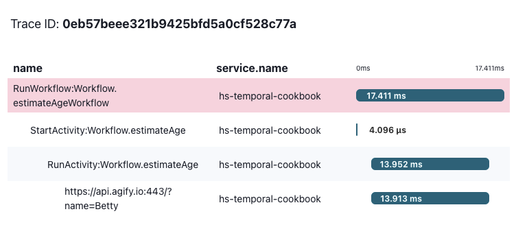

# Age Estimation Workflow

This example provides a Workflow that can estimate someone's age, 
based on their given name. It uses a single Activity implementation, 
which calls a remote API to retrieve this estimation.

Start the Worker:

```shell
$ cabal run age-estimation:worker
```

In addition to the Worker, it also includes a file [`Client.hs`](./Client.hs)
that you can use to run the Workflow (pass a name to use as input 
on the command line when invoking it). 

```shell
$ cabal run age-estimation:client -- Betty
```

This will output a message with the name and estimated age:

```
Betty has an estimated age of 78
```

## Testing

Additionally, this example provides tests for the Workflow 
and Activity code.

```shell
$ cabal test age-estimation:spec
```

This will spawn a temporary development server and a worker configured to
process the workflow under test.

A successful test run should produce a bunch of interleaved output from
Temporal along with the following:

```
Finished in 0.5924 seconds
3 examples, 0 failures
Test suite spec: PASS
```

## OpenTelemetry Instrumentation

This sample also includes OpenTelemetry instrumentation for the Temporal worker
(by way of [`Temporal.Contrib.OpenTelemetry`]) and the external HTTP client
calls (by way of [`OpenTelemetry.Instrumentation.HttpClient`]).

We've included a separate Nix devshell that provides [`otel-desktop-viewer`]
and some preset `OTEL_` environment variables so this can be observed locally.

If it's still running from earlier, stop the Worker and exit the Nix dev shell.

Launch the `otel-desktop-viewer`, this should automatically open your default
browser to the viewer's landing page:

```shell
$ nix develop .#otel --accept-flake-config --command otel-desktop-viewer
```

...and then, in a separate terminal window, enter the OpenTelemetry dev shell
and start the Worker:

```shell
$ nix develop .#otel --accept-flake-config
$ cabal run age-estimation:worker
```

...finally, invoke the client again (this doesn't have to be from within
the OpenTelemetry dev shell, the same dev shell you used earlier is fine!):

```shell
$ cabal run age-estimation:client -- Betty
```

This should output the same result as before, along with a trace in the web UI:



[`Temporal.Contrib.OpenTelemetry`]: https://github.com/MercuryTechnologies/hs-temporal-sdk/blob/main/sdk/src/Temporal/Contrib/OpenTelemetry.hs
[`OpenTelemetry.Instrumentation.HttpClient`]: https://github.com/iand675/hs-opentelemetry/blob/main/instrumentation/http-client/src/OpenTelemetry/Instrumentation/HttpClient.hs
[`otel-desktop-viewer`]: https://github.com/iand675/hs-opentelemetry/blob/main/instrumentation/http-client/src/OpenTelemetry/Instrumentation/HttpClient.hs
